# Hey, I'm Kadyr 👋

Project manager & sysadmin who loves to vibe-code.  
Started as a Unity developer, now I build things across the full stack — and sometimes break them.

## 🛠 Languages

## 📊 Stats

  
  

  

## 📬 Contact

